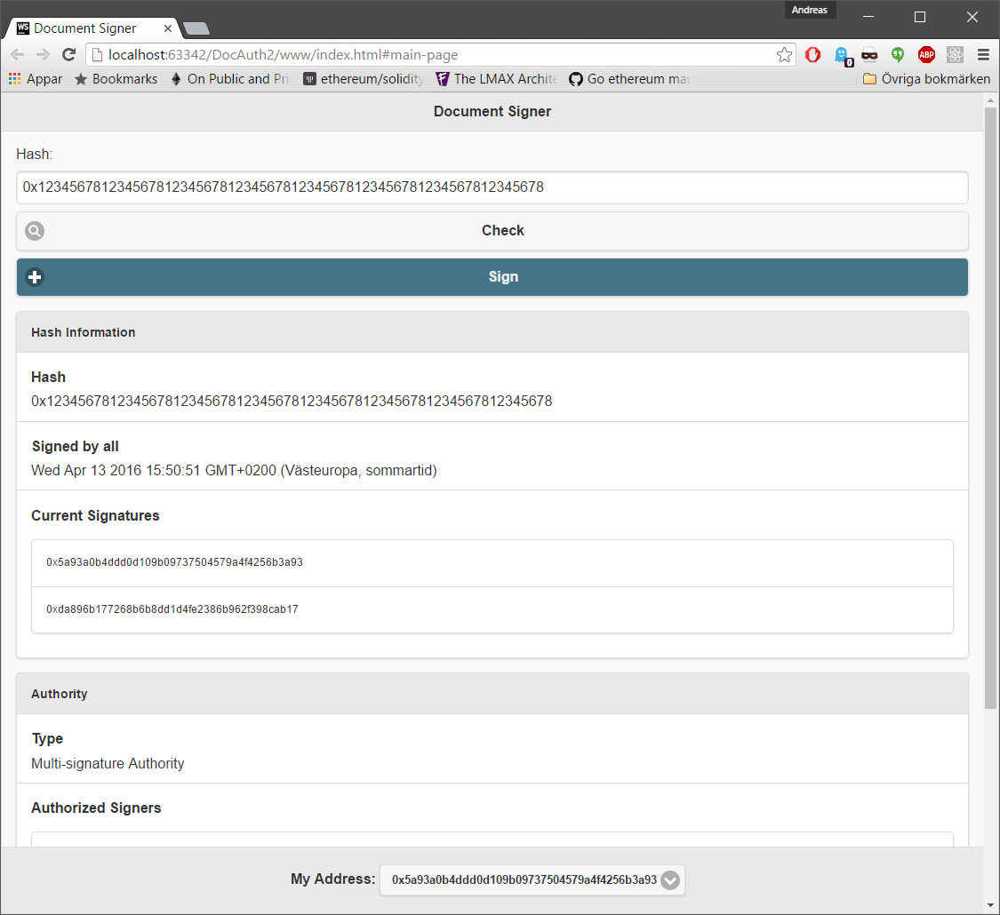

# doc-auth

Very simple example [Ethereum](https://www.ethereum.org/) DApp that allows accounts to act as a certificate authority by signing bytes. The contract allows a maximum of 192 different signers, though it would usually not have more then 10-20.

There are two use-cases for the contract.

1. Users can load the web-page (locally) and check if a hash is signed by the authority, or simply load it into the Mist browser and check from there.

2. The contract can be called from other contracts; for example to validate input, contract bytecode, or other on-chain data.

### The smart contract

The [MultiSignerAuthority contract](https://github.com/androlo/doc-auth-multi/blob/master/contracts/src/MultiSignerAuthority.sol) is the only contract in this app. It is about 800 bytes in size, and has a base deployment cost of about 300k gas ("base" because it takes an array as constructor input).

##### Signers

Signers are added as an array of addresses, and is passed to the constructor. The array must have at least `1` element, and at most `192`. It may not contain any duplicates, and must be sorted such that for all valid indices `i` and `j`, `i < j <=> uint(arr[i]) < uint(arr[j])`. This is enforced in the constructor which will throw if the array is not well-formed.

The length of the address array is stored at address `0x1`. The array itself is stored in order from `0x2` (up to `0x7B`).

##### Signing

Signing is done by calling `sign(bytes32 data)`. Each data post has an associated `uint` where the 64 most significant bytes are reserved for a timestamp, and the other 192 for marking signatures. This means each data post uses one single storage slot, which is the same amount as for the simpler [single signer authority](https://github.com/androlo/doc-auth). The uint is stored at storage address 'data', which means O(1) access through `sload`.

When signing a hash, the bit used is the one corresponding to the address index of the sender, meaning if the signer was passed in as `array[5]` in the constructor, the fifth bit of the hash data is set. When all signers have signed a hash, the block timestamp is added.

The only restriction to the input data is that the value `uint(data) > 193`, so that it does not overwrite anything to do with the signer addresses.

### Running the demo

To run the demo you need to have a running public chain node, and know how to interact with it. Instructions on how to set up an Ethereum node can be found on the Ethereum project page, and on the official page of the most popular Ethereum client [geth](http://ethereum.github.io/go-ethereum/).

When the Ethereum node is running (and answering to RPC calls), just start `www/index.html` in a web-browser. Near the bottom of the page you will find several examples of documents and their hashes that you can paste into the hash field and `check`.

The web-page points to an Ethereum contract deployed by me, where I set the signers to be two of my accounts. The contract is an instance of `MultiSignerAuthority` (which can be found in the `contracts/src` folder), and is deployed on the public chain.

#### Troubleshooting

If the page fails to load, you will get an alert. If the alert says that the RPC server does not respond, make sure that:

- Ethereum is running, and answers to RPC calls on the correct address and port. You can change the address and port at line 8 of `www/scripts/index.js`.

- CORS is set (with `geth` you could add `--rpccorsdomain "*"` to check if this is the issue).

If the page says that contract data can't be read, make sure that:

- the Ethereum node is running the public chain.

### Create a new SingleSignerAuthority

To create Your own authority You need to do this:

1. Deploy a new instance of `MultiSignerAuthority`. This can not be done properly by passing bytecode to the [Mist wallet](https://github.com/ethereum/mist) I think, because it has constructor params. At least I had to use the source code, and it gave me some pretty whacky gas values. The bytecode and ABI can be found in `contracts/build`. It does not matter if you add it to the public chain (Homestead), the test-chain (Morden), or a local dev-chain.

2. Open `www/scripts/index.js` and change the `contractAddress` variable (line 7) to the new address.

3. Run the webpage.

#### Troubleshooting

In addition to the RPC alert, you may now also get an alert that says the contract can't be read. In that case make sure that you updated the `index.js` file with the new contract address.

If there is no blue `sign` button below the hash field, make sure that the current `coinbase` address is the same as the one used when deploying the contract.

### Testing the contract (node.js)

Contract tests are done using [QUnit](http://qunitjs.com/) against an [ethereumjs-testrpc]((https://github.com/ethereumjs/testrpc)) server. This is how you run them:

1. Make sure `node.js` and `npm` is on your path. **NOTE** To run `testrpc` on Windows you need to do some additional preparation. Instructions can be found [here](https://github.com/ethereumjs/testrpc/wiki/Installing-TestRPC-on-Windows). If you don't intend on using testrpc, this is probably not worth the effort.

2. cd into the project root and type `npm install`. This will install testrpc locally.

3. cd into the `testserver` folder and run `testserver.js`. Wait for it to print `Ethereum test RPC server listening on port 8545`.

4. Start a contract test in a web-browser. The tests currently available is:

- `www/testing/ssa_contract_test.html` - Single Signer Authority

- `www/testing/msa_contract_test.html` - Multi Signer Authority

### Hacking

If you want to edit the smart-contract you need to know how to code in Solidity. The Solidity project page can be found [here](http://solidity.readthedocs.org/en/latest/).

A simple way to add more features to the contract is to copy the code from `contracts/src/SingleSignerAuthority.sol` into the [Online Solidity Compiler](https://chriseth.github.io/browser-solidity/). It has syntax highlighting and does real-time error checking, and even allow you to deploy the contract onto a simulated chain and interact with it - although the output is not formatted so it may be a bit hard to read. Either way, when you are happy with the edits you can just get the bytecode and ABI (interface) from the online compiler and put it into Mist (or whatever you want to use for deploying and interacting with the contract on-chain).